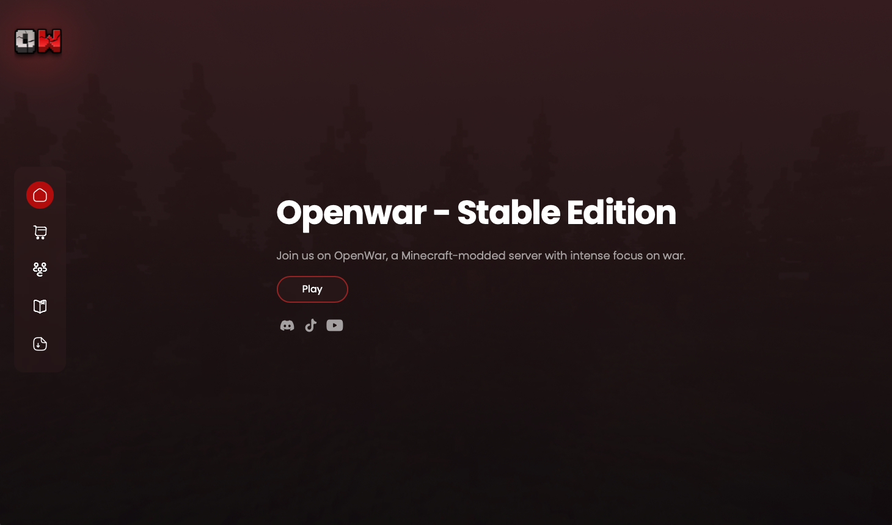

# Openwar MC



## Description

This is a minecraft server website.

## Live Demo

Check out the live demo of the project [here](https://openwar.fr/#home).
You also can join the discord server [here](https://discord.com/invite/VPBufsbTg7).

## Table of Contents

- [Description](#description)
- [Live Demo](#live-demo)
- [Installation](#installation)
- [License](#license)
- [Contact](#contact)

## Installation

If someone wants to run your project locally, they can follow these steps:

1. Clone the repository:
    ```bash
    git clone https://github.com/Tixeo/Openwar-MC.git
    ```
2. Navigate to the project directory:
    ```bash
    cd Openwar-MC
    ```
3. Install the dependencies (if any):
    ```bash
    npm install
    ```
4. Start the development server:
    ```bash
    node server.js
    ```
5. Open your browser and go to `http://localhost:9999`.

## License

This project is licensed under the MIT License - see the [LICENSE](LICENSE) file for details.

## Contact

If you have any questions :

- Discord : tixeo#0000
- GitHub: [Tixeo](https://github.com/Tixeo)
